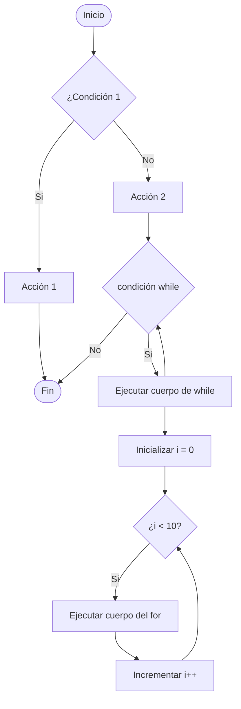
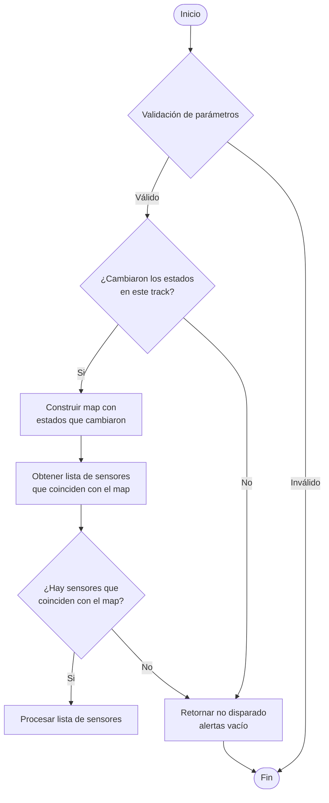

# Modulo/Paquete rule

Ejemplo de Diagrama de flujo con mermaid

```mermaid
flowchart TD
  start([Inicio]) --> firstCondition{¿Condición 1}
  firstCondition --> |Si| action1[Acción 1]
  firstCondition --> |No| action2[Acción 2]
  action1 --> endFlow([Fin])
  action2 --> whileCondition{condición while}
  whileCondition --> |Si| whileBody[Ejecutar cuerpo de while]
  whileBody --> forInit[Inicializar i = 0]
  forInit --> forCondition{¿i < 10?}
  forCondition --> |Si| forBody[Ejecutar cuerpo del for]
  forBody --> forIncrement[Incrementar i++]
  forIncrement --> forCondition
  whileBody --> whileCondition
  whileCondition --> |No| endFlow
```

## Procesar evento de sensor

```mermaid
flowchart TD
  startFlow([Inicio]) --> funcValidation{Validación de parámetros}
  funcValidation --> |Válido| changeStateListCheck{"¿Cambiaron los estados<br> en este track?"}
  funcValidation --> |Inválido| endFlow
  changeStateListCheck --> |Si| buildDifferenceStateMap[Construir map con <br>estados que cambiaron]
  changeStateListCheck --> |No| returnNoTriggerNoChange[Retornar no disparado<br> alertas vacío]
  buildDifferenceStateMap --> getSensorMatchList[Obtener lista de sensores <br> que coinciden con el map]
  getSensorMatchList --> sensorMatchListCheck{"¿Hay sensores que <br>coinciden con el map?"}
  sensorMatchListCheck --> |Si| processSensorMatchList[Procesar lista de sensores]
  sensorMatchListCheck --> |No| returnNoTriggerNoChange
  returnNoTriggerNoChange --> endFlow
  endFlow([Fin])
```
